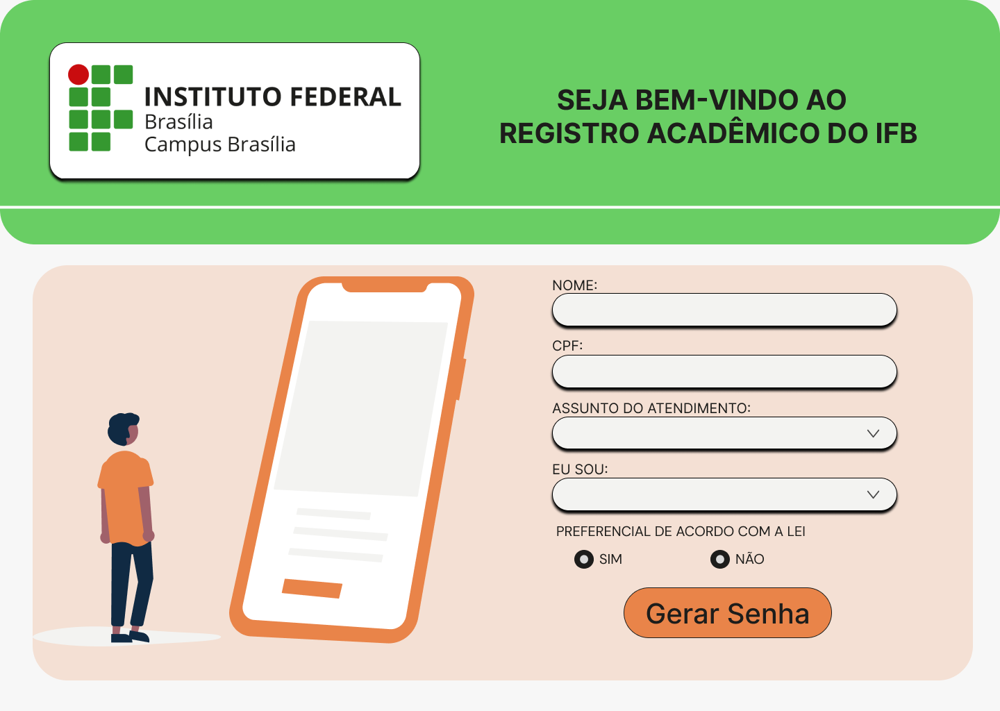
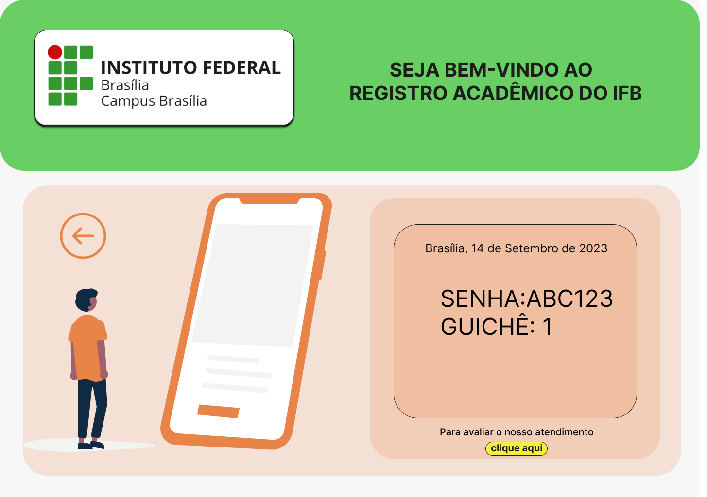
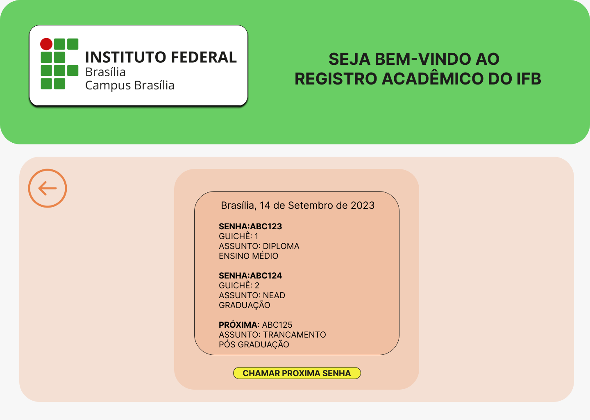

# 👾 PROTÓTIPO SISTEMA DE GERENCIAMENTO DE SENHAS
O projeto nasceu na matéria Projeto Integrador do Instituto Federal de Brasília, que tem como objetivo auxiliar alunos em seus projetos com finalidades diferentes, no ano de 2022. Atualmente, está em seu 3º semestre de desenvolvimento. A ideia principal é desenvolver um sistema de gerenciamento de senhas para o registro acadêmico do IFB. 

## 🔍 Índice

- Documentação do Sistema
- Funcionalidades do Projeto.
- Layout.
- Tecnologias Utilizadas.
- Autores.

## 📜 Documentação do Sistema

https://docs.google.com/document/d/1ObbhetXFgYdJCgNsQbxjUWuw4kB5NFZe/edit

## 🔧Funcionalidades do Projeto

-[x] Registro de usuário.

-[x] Identificação de prioridade do usuário caso haja.

-[x] Gerenciamento de atendimento. 

-[x] Convocação de pessoas prioritárias.

-[x] Organização da seção local do registro acadêmico do Instituto Federal de Brasília.  

## ✍️Layout

## 🖥️ Tecnologias utilizadas
1. HTML5
2. CSS3
3. [Figma](https://www.figma.com/)
4. JavaScript
5. [Node.JS](https://nodejs.org/en)
6. [Angular](https://angular.io/)
7. [Bootstrap](https://getbootstrap.com/)

## 🖊️ Autores
1. <a href="https://github.com/Jalys0n">José Alyson</a>
2. <a href="https://github.com/JaqueNobre">Jaqueline Nobre</a> 
3. <a href="https://github.com/cleorbeth">Cleorbeth Santos</a>
